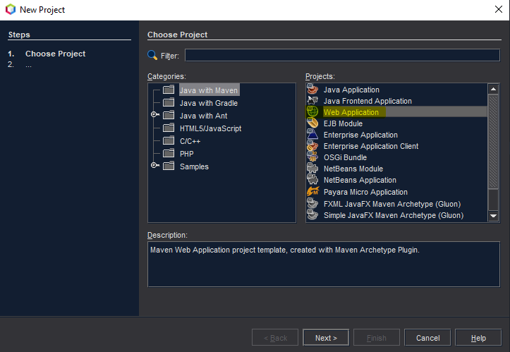

<h1>How to create a RESTful API in JAVA EE | Cómo crear una API RESTful en JAVA EE</h1>

<h3>What is a RESTful API, and why do I need it? | ¿Qué es una API RESTful y por qué la necesito?</h3>

 
  <em> According to the definition proposed by Mauro Chojrin, professor at <a href="https://platzi.com/clases/1638-api-rest/21611-que-significa-rest-y-que-es-una-api-restful/?utm_source=google&utm_medium=cpc&utm_campaign=12915366154&utm_adgroup=&utm_content=&gclid=Cj0KCQiA8ICOBhDmARIsAEGI6o1Fvr3YXuIxT9IEmg3k9BmzaeZqlOoYXDMegWt9eKe6tipg8Ug-QJIaAgxWEALw_wcB&gclsrc=aw.ds"> Platzi </a> </em>  
  REST is an acronym for Representational State Transfer or representational state transfer, it adds a very thin layer of complexity and abstraction to HTTP. 
  While HTTP is file transfer, REST is based on the transfer of resources. 
  A <strong> RESTful API </strong> is an API designed with the concepts of REST: 
  <ul>
    <li> Resource: everything within a RESTful API must be a resource.</li> 
    <li> URI: the resources in REST are always manipulated from the URI, universal identifiers of resources.</li>
    <li> Action: all requests to your RESTful API must be associated with one of the HTTP verbs: 
      <code> GET </code> to get a resource, <code> POST </code> to write a resource, <code> PUT </code> to modify a resource and <code> DELETE </code> to delete it. </li> 
  </ul>
  REST is very useful when:
  <ul>
    <li> The interactions are simple.</li>
    <li> Your hardware resources are limited. </li> 
  </ul> 
  Not suitable when interactions are very complex. 

<h7>Español</h7>

 
  <em> Según la definición propuesta por Mauro Chojrin, profesor en <a href="https://platzi.com/clases/1638-api-rest/21611-que-significa-rest-y-que-es-una-api-restful/?utm_source=google&utm_medium=cpc&utm_campaign=12915366154&utm_adgroup=&utm_content=&gclid=Cj0KCQiA8ICOBhDmARIsAEGI6o1Fvr3YXuIxT9IEmg3k9BmzaeZqlOoYXDMegWt9eKe6tipg8Ug-QJIaAgxWEALw_wcB&gclsrc=aw.ds"> Platzi </a> </em>  
  REST es un acrónimo de Representational State Transfer o transferencia de estado representacional, le agrega una capa muy delgada de complejidad y abstracción a HTTP. 
  Mientras que HTTP es transferencia de archivos, REST se basa en la transferencia de recursos. 
  Una <strong> API RESTful </strong> es una API diseñada con los conceptos de REST: 
  <ul> 
    <li> Recurso: todo dentro de una API RESTful debe ser un recurso.</li> 
    <li> URI: los recursos en REST siempre se manipulan a partir de la URI, identificadores universales de recursos.</li> 
    <li> Acción: todas las solicitudes a tu API RESTful deben estar asociados a uno de los verbos de HTTP: 
      <code> GET </code> para obtener un recurso, <code> POST </code> para escribir un recurso, 
      <code> PUT </code> para modificar un recurso y <code> DELETE </code> para borrarlo. </li>
  </ul>
  REST es muy útil cuando:
  <ul>
    <li> Las interacciones son simples.</li>
    <li> Los recursos de tu hardware son limitados. </li>
  </ul> 
  No conviene cuando las interacciones son muy complejas. 

<h3>Initial Setup | Configuración inicial</h3>

  In the case of this guide, we will build a remote employee entry control program, for this, 
  we must initially generate the database that will store the names of the employees, and the hours of entry and exit of these. 
  We will use the <strong> MySQL </strong> engine for data management, however, 
  the database can be generated with any other <strong> engine (SQLServer, OracleServer,  PostgreSQL, MongoDB).</strong> 
  Additionally, we will host the application on the Apache Tomcat web server, in its 9th version, available <a href="https://tomcat.apache.org/download-90.cgi"> here </a>,
  which by default, configures port <strong> 8080 </strong> to receive and send HTTP and HTTPS requests.

<h7>Español</h7>

  Para el caso de esta guía, construiremos un programa de control de ingreso de empleados remoto, para esto, inicialmente debemos generar la base de datos 
  que almacenará los nombres de los empleados, y las horas tanto de ingreso como de salida de estos. 
  Utilizaremos el motor <strong>MySQL</strong> para la administración de los datos, sin embargo, 
  se puede generar la base de datos con cualquier otro motor <strong>(SQLServer, OracleServer, PostgreSQL, MongoDB).</strong> 
  Adicionalmente la aplicacion la alojaremos en el servidor web Apache Tomcat, en su 9na version, disponible <a href="https://tomcat.apache.org/download-90.cgi">aquí</a>,
  que por defecto, configura el puerto <strong>8080</strong> para recibir y enviar solicitudes HTTP y HTTPS.

<h3>Step 1 | Paso 1</h3>

  To create the database and tables, enter the following code  
  <pre>
  CREATE USER 'your_user'@'localhost' IDENTIFIED BY 'your_password';
  GRANT ALL PRIVILEGES ON ´company´ TO 'your_user'@'localhost';
  FLUSH PRIVILEGES;   CREATE DATABASE `company`;
  USE `company`;  
  CREATE TABLE `employees` (    
    `id` INT(3) PRIMARY KEY,
    `name` VARCHAR(10)   
  );
  CREATE TABLE `records` (
    `id` INT(3) PRIMARY KEY,
    `arriveTime` DATETIME,
    `leaveTime` DATETIME
  );</pre>

<h7>Español</h7>

  Para crear la base de datos y las tablas, ingrese el siguiente codigo  
  <pre>
  CREATE USER 'your_user'@'localhost' IDENTIFIED BY 'your_password';
  GRANT ALL PRIVILEGES ON ´company´ TO 'your_user'@'localhost';
  FLUSH PRIVILEGES;   CREATE DATABASE `company`;
  USE `company`;  
  CREATE TABLE `employees` (    
    `id` INT(3) PRIMARY KEY,
    `name` VARCHAR(10)   
  );
  CREATE TABLE `records` (
    `id` INT(3) PRIMARY KEY,
    `arriveTime` DATETIME,
    `leaveTime` DATETIME
  );</pre>

<h3>Step 2 | Paso 2</h3>

  Once the database is created, with the help of our IDE, we create a JAVA project with the Maven tool (Apache Maven).
   
  Then, in the file <code>pom.xml</code>, add the connection driver with MySQL. 
  To add the dependency easily copy the code below, inside the <code>dependencies</code> tag
   
  Finally, the <code>DataSource</code> object allows us to create and maintain a certain number of connections to the database during the execution of the program,
  This is known as a <strong> Connection Pool </strong>, and saves resources, since a connection will not be forced every time a user accesses our API,
  Instead, the system will assign one of the open connections for that request. 
  To include it in our project, and configure this <strong> Pool of connections </strong>, in the <code> context.xml </code> file,
  located in the path <code>src/main/webapp/META-INF</code>, we enter the <code>Resource</code> tag with the instructions for our connection 
    

<h7>Español</h7>

  Una vez creada la base de datos, con al ayuda de nuestro IDE, creamos un proyecto JAVA con la herramienta Maven (Apache Maven).
   
  Luego, en el archivo <code>pom.xml</code>, agregue el driver de conexión con MySQL. 
  Para agregar la dependencia copie el codigo a continuación, dentro de la etiqueta <code>dependencies</code>
   
  Finalmente, el objeto <code>DataSource</code>, nos permite crear y mantener un número determinado de conexiones a la base de datos durante la ejecución del programa, 
  esto se le conoce como un <strong>Pool de Conexiones</strong>, y permite ahorrar recursos, dado que no se forzará una conexión cada vez que un usuario acceda a nuestra API,
  sino que el sistema asignará una de las conexiones abiertas para esa petición. 
  Para incluirlo en nuestro proyecto, y configurar ese <strong>Pool de conexiones</strong>, en el archivo <code>context.xml</code>, 
  ubicado en la ruta <code>src/main/webapp/META-INF</code>, ingresamos la etiqueta <code>Resource</code> con las instrucciones para nuestra conexión 
   

